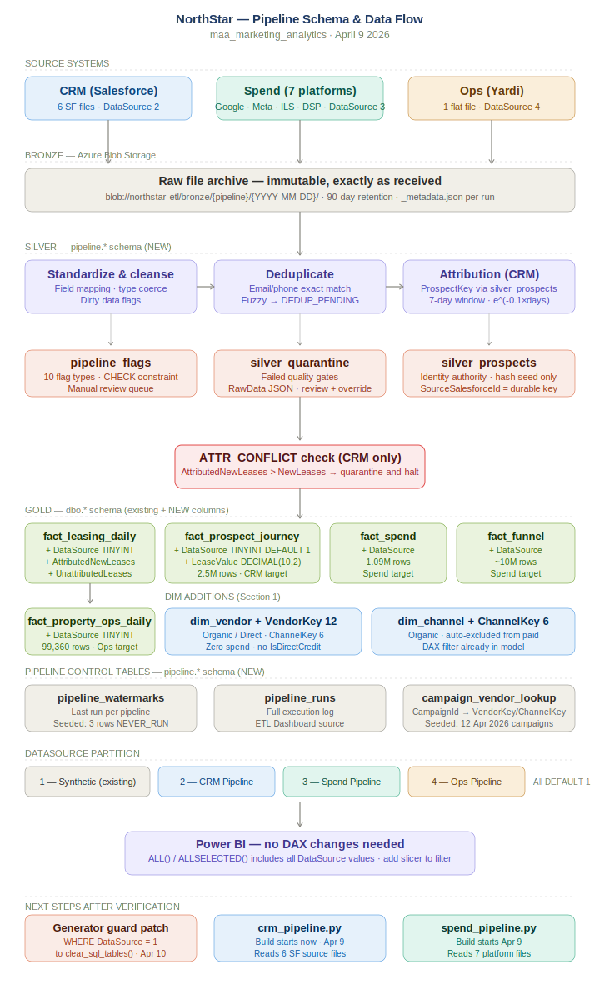
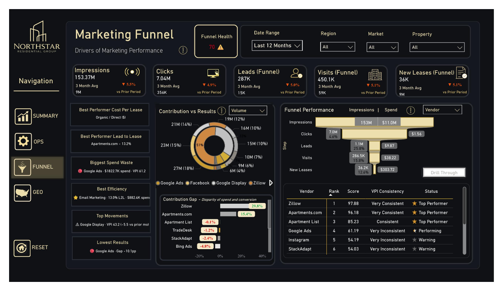
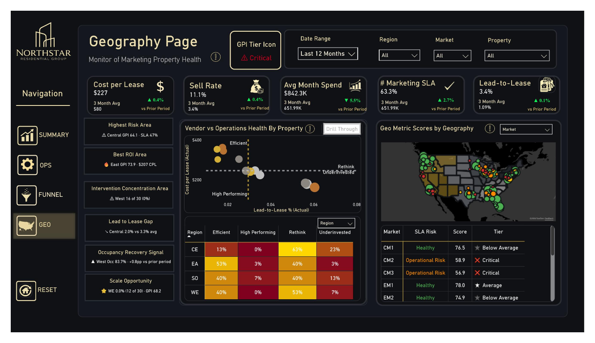
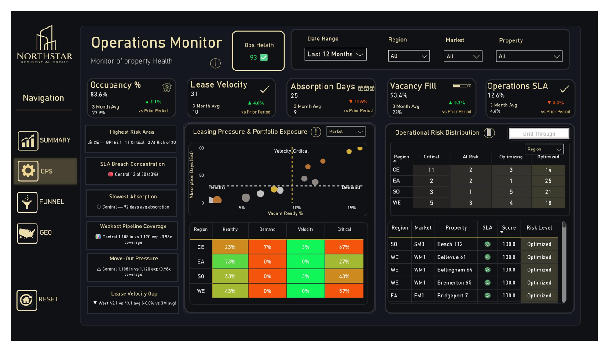
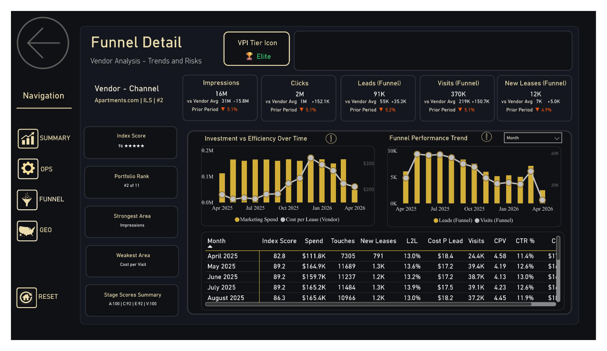
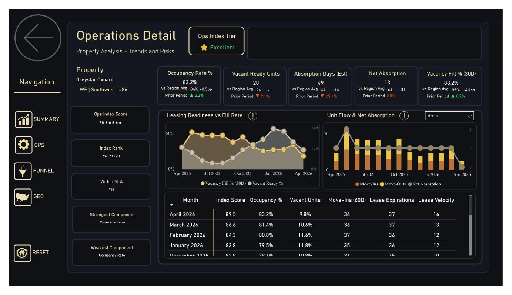
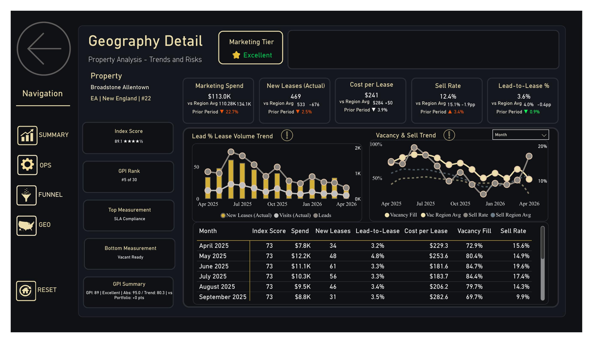
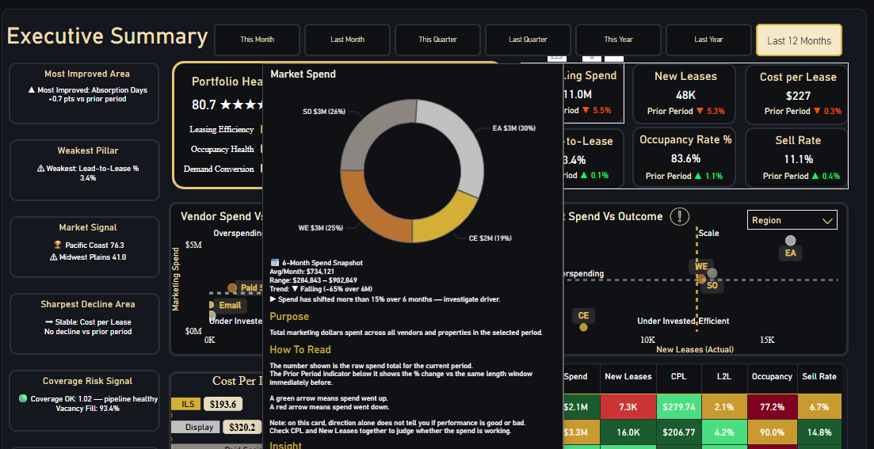

# Northstar Residential Group — Marketing Analytics Platform

A full-scale, end-to-end marketing analytics system I designed to simulate how a real multifamily real estate organization measures performance. Connecting marketing spend and attribution to leasing outcomes and occupancy through a continuously updated, deterministic data pipeline.

This is not a dashboard demo, it’s a fully modeled analytics ecosystem with aligned funnel, attribution, and operational data designed to mirror real-world decision environments, supported by automated monitoring that tracks ETL pipeline health, logs failures, and triggers alerts.

---

## Executive Dashboard

*A portfolio-level view of marketing performance, leasing efficiency, and operational health across 120 properties, 12 markets, and 4 regions, built using real-world marketing analytics frameworks and domain and real world experience to reflect how performance is measured in practice.

---

## The Problem This Solves

Marketing performance data is inherently fragmented across systems.

- Spend lives in ad platforms (Google Ads, Meta, Programmatic Display Ads, Paid Search, ILS partners, etc..)
- Leads and interactions live in CRM systems
- Leasing outcomes live in property management systems
- Operational metrics (occupancy, absorption, vacancy) live elsewhere entirely

These systems are rarely aligned — and the data within them is often inconsistent.

- Duplicate lead records and inconsistent identifiers across systems  
- Incomplete or delayed CRM updates  
- Mismatched attribution logic between platforms  
- Data quality issues that distort funnel and conversion metrics  

As a result, organizations struggle to answer fundamental questions:

- Which marketing channels are actually driving leases?
- Where is spend efficient versus wasted?
- How does marketing performance vary by market and property?
- How do marketing efforts translate into operational outcomes like occupancy?

Legacy reporting approaches — often static, tabular, and disconnected — make this even harder by requiring manual reconciliation, masking data quality issues, and limiting visibility across the full funnel.

This project was built to solve that problem by creating a unified, end-to-end analytics system where:

**Spend → Funnel → Prospect Journey → Leasing → Operations**

are fully aligned, standardized, and measurable within a single model.

---

## System Flow

This is the end-to-end architecture that powers the platform:

This platform is designed as a full analytics pipeline, not just a reporting layer.

Data flows from synthetic source generation through bronze ingestion, silver standardization, identity resolution, and attribution modeling before being published to gold fact tables that power the Power BI semantic model.

Each stage includes validation, data quality checks, and audit logging to ensure that marketing activity can be consistently traced from spend through funnel performance, prospect journeys, leasing outcomes, and operational results.

The pipeline is supported by monitoring and logging infrastructure that tracks run status, captures failures, enforces watermark-based processing, and triggers alerts when issues occur.

---

## Technical Deep Dive

This project includes full pipeline documentation covering data ingestion, validation, identity resolution, attribution modeling, and audit layer design.

[View CRM Pipeline Process Documentation](./images/CRM_Pipeline_Process_Documentation.docx)

---

## Engagement Overview

Northstar Residential Group is a fictional, enterprise-scale multifamily real estate company used for this portfolio case study. The organization operates a large, geographically distributed property portfolio and relies heavily on digital marketing to drive leasing demand.

This engagement simulates the design and delivery of a dedicated marketing analytics platform built to replace legacy SSRS-based reporting, which provided accurate data but lacked visibility, flexibility, and the ability to connect performance across the full marketing and leasing lifecycle.

At the time of the engagement, marketing stakeholders faced several limitations:

- Performance data was fragmented across platforms (ad networks, CRM, property systems)  
- Reporting was static and difficult to interpret at an executive level  
- Attribution between marketing activity and leasing outcomes was unclear  
- Data quality issues (duplicate records, inconsistent identifiers, incomplete CRM data) created additional uncertainty  

The objective of this project was to design a unified analytics system that could:

- Align marketing spend, funnel performance, and leasing outcomes  
- Provide consistent attribution across channels and touchpoints  
- Surface performance at the portfolio, market, and property level  
- Improve visibility into both marketing efficiency and operational impact  

---

## Dashboard Walkthrough

The reporting layer is designed to move from high-level portfolio insights to detailed, drillthrough analysis at the vendor, region, market, and property level.

### Executive Summary (Portfolio-Level View)

The executive dashboard provides a top-down view of marketing and operational performance, combining spend, leasing outcomes, and portfolio health into a single view.

- Portfolio Health score aggregates leasing efficiency, occupancy, and demand conversion
- Spend vs outcome visuals highlight over-invested and under-invested regions
- Signal-based indicators identify weakest pillars, risk areas, and performance trends

This view is designed to answer:
- Where is the portfolio underperforming?
- Where should attention be prioritized?

---

### Funnel Performance & Vendor Analysis

The funnel page breaks down marketing performance across the full conversion path:

**Impressions → Clicks → Leads → Visits → Leases**

- Funnel drop-off highlights conversion bottlenecks
- Vendor performance is ranked based on consistency and efficiency
- Contribution vs results analysis identifies spend inefficiencies

This enables:
- Identification of underperforming channels
- Reallocation of budget toward higher-performing vendors
- Diagnosis of funnel leakage

---

### Geography Performance & Market Risk

The geography page connects marketing efficiency to location-based performance, helping identify where spend is working, where intervention is needed, and where scale opportunities exist.

- GPI logic classifies areas into performance groupings such as efficient, high performing, rethink, and underinvested
- Regional and market signals surface highest-risk areas, best ROI areas, and concentration of intervention needs
- Map and scatterplot views make it easier to compare property-level outcomes across geographies

This answers:
- Which markets are underperforming relative to spend?
- Where should strategy be scaled, rethought, or corrected?

---

### Operations & Property Health

Operational metrics are integrated directly with marketing performance to connect demand generation with leasing outcomes.

- Vacancy fill, absorption days, and SLA compliance highlight operational risk
- Risk distribution identifies critical vs optimized properties
- Portfolio exposure visuals show demand vs leasing pressure

This answers:
- Which properties are operationally at risk?
- How is marketing impacting leasing outcomes?

---

### Drillthrough: Vendor & Funnel Trends

Vendor-level drillthrough provides detailed trend analysis across time.

- Marketing spend vs efficiency over time
- Funnel performance trends across leads, visits, and leases
- Cost and conversion metrics by period

This enables:
- Monitoring of vendor consistency
- Identification of declining performance trends
- Evaluation of marketing efficiency over time

---

### Drillthrough: Property-Level Operational Trends

Operations drillthrough allows individual properties to be reviewed in detail over time.

- Occupancy trends, unit flow, and net absorption
- Leasing readiness vs fill rate
- Property-level scoring, ranking, and weakest/strongest components

This allows:
- Identification of localized operational issues
- Validation of whether interventions are working
- Tracking of property health over time

---

### Drillthrough: Geography Detail by Property

Geography drillthrough extends the market-level view into specific properties, making it possible to evaluate local performance in context.

- Spend, leases, cost per lease, sell rate, and lead-to-lease by property
- Trend views compare property-level results against regional patterns
- GPI detail surfaces top and bottom measurements for a property

This enables:
- Deeper diagnosis of regional underperformance
- Comparison of property results against market and region expectations
- Identification of whether issues are driven by marketing efficiency, leasing conversion, or broader operational conditions
---
---

## Performance Index Framework

At the core of the system is a multi-index scoring framework designed to translate complex, multi-source data into clear, actionable performance signals.

Rather than relying on raw metrics alone, the platform uses four purpose-built index models — each answering a different business question — and integrates them into a unified decisioning layer.

---

### The Four-Index Model

The system is structured around four complementary indexes:

- **Vendor Performance Index (VPI)** → Marketing effectiveness  
- **Operations Index** → Property operational health  
- **Geography Performance Index (GPI)** → Market-level stability and momentum  
- **Portfolio Health Index (PHI)** → Unified portfolio performance  

Each index uses a **different normalization philosophy**, intentionally designed to reflect the nature of the question it answers.

This avoids a common analytics mistake: forcing all performance into a single scoring logic.

---

### Vendor Performance Index (Marketing Performance)

The Vendor Performance Index evaluates how effectively each marketing vendor drives leasing outcomes across the full funnel:

**Impressions → Clicks → Visits → Leads → Leases**

- Uses a **benchmark credit system** against trailing portfolio averages  
- Applies **funnel-stage weighting**, with conversion carrying the highest impact  
- Adapts dynamically to vendor participation (not all vendors operate across all stages)

This allows marketing performance to be evaluated in context — not just volume, but efficiency and conversion quality.

:contentReference[oaicite:0]{index=0}

---

### Operations Index (Operational Health)

The Operations Index measures whether properties are operationally capable of converting demand into occupancy.

It is built from seven core components:

- Occupancy
- Vacancy exposure
- Absorption speed
- Coverage ratio
- Lease velocity
- Net absorption
- SLA compliance

Each component is normalized against **fixed performance ranges**, creating a consistent 0–100 score representing operational readiness.

This index acts as a **leading indicator of leasing risk**, identifying breakdowns before they impact occupancy.

:contentReference[oaicite:1]{index=1}

---

### Geography Performance Index (Market Stability & Momentum)

The Geography Performance Index evaluates how markets and regions are performing over time.

It combines two distinct perspectives:

- **Pillar 1 (60%) — Stability**  
  Performance vs prior-year portfolio benchmark  

- **Pillar 2 (40%) — Momentum**  
  Improvement or decline vs the immediately preceding period  

This dual-pillar design allows the model to distinguish between:

- Stable vs declining markets  
- Recovering vs historically strong markets  

Importantly, GPI is not a ranking system — it measures **performance relative to a market’s own history**, not other geographies.

:contentReference[oaicite:2]{index=2}

---

### Portfolio Health Index (Unified Performance)

The Portfolio Health Index (PHI) combines all domains into a single, interpretable score.

It is structured across three pillars:

- Operations (35%)
- Marketing Funnel (35%)
- Geo / Actual Outcomes (30%)

Each pillar uses **fixed absolute ranges**, meaning the score reflects performance against a defined standard — not relative comparison.

This creates a stable, executive-level signal of overall portfolio health.

:contentReference[oaicite:3]{index=3}

---

### Why Multiple Indexes Instead of One?

Each index answers a different question:

| Index | What It Answers |
|------|----------------|
| VPI | Are vendors driving efficient, high-quality demand? |
| Operations Index | Can properties convert demand into occupancy? |
| GPI | Are markets improving or declining over time? |
| PHI | Is the overall portfolio healthy? |

A single score cannot capture all of these dimensions without losing meaning.

---

### Portfolio Health Score (Dashboard Layer)

While the underlying index framework is preserved, the dashboard introduces a **Portfolio Health Score** to provide a simplified executive view.

This score:

- Aggregates signals across marketing, operations, and leasing outcomes  
- Avoids directly blending incompatible normalization methods  
- Acts as a **top-level health indicator**, not a replacement for underlying indexes  

The design intentionally separates:

- **Analytical scoring (indexes)**  
- **Executive summarization (portfolio health)**  

This ensures that detail and accuracy are not lost in simplification.

---

### Design Philosophy

This system was built with three principles:

- **Separation of concerns** — each index answers a specific question  
- **Context-aware scoring** — normalization method matches the business problem  
- **Actionability over reporting** — every score is tied to a decision  

The result is not just a reporting layer, but a structured decision framework that connects marketing investment, operational execution, and leasing outcomes.
## Data & Privacy Notice
Northstar Residential Group is a fictional company created for portfolio purposes. All data used in this project is simulated. Table structures, KPIs, and reporting logic are modeled after real enterprise marketing analytics environments, but no proprietary or client data is included.

Power BI files and full datasets are intentionally excluded from this repository.

---

## Technical Documentation

Detailed technical documentation for each scoring model is available below. These documents outline full calculation logic, DAX structure, normalization methods, and design rationale.

- 📄 [Vendor Performance Index (VPI)](./images/VPI_Reference.docx)
- 📄 [Operations Index](./images/Operations_Index_Reference.docx)
- 📄 [Geography Performance Index (GPI)](./images/GPI_Reference_v2.docx)
- 📄 [Portfolio Health Index (PHI)](./images/PHI_Reference.docx)

These references reflect production-level model design, including benchmark methodologies, weighting frameworks, and performance tiering logic.

---

## Analytical Logic & Decisioning Layer

This platform is designed to go beyond traditional reporting by embedding analytical logic directly into the user experience.

Rather than presenting static metrics or trends, the system continuously evaluates performance using benchmark comparisons, trend analysis, and rule-based logic to generate interpretable signals and recommended actions.

---

### From Metrics to Signals

Each metric in the system is evaluated across three dimensions:

- **Current Performance** → Where is the metric relative to defined benchmarks?  
- **Trend Direction** → Is performance improving, declining, or stable over time?  
- **Contextual Comparison** → How does performance compare across regions, markets, and properties?  

These dimensions are combined to convert raw data into **performance signals**, rather than isolated values.

---

### Benchmark-Aware Interpretation

Metrics are not evaluated in isolation.

- Performance is compared against **fixed benchmark ranges** or **portfolio baselines**  
- Indicators dynamically adjust based on whether a metric is:
  - Above expected range  
  - Within acceptable range  
  - Below benchmark thresholds  

This allows the system to determine whether a result is **good, neutral, or concerning**, not just higher or lower.

---

### Trend + Snapshot Integration

The platform simultaneously presents:

- **Snapshot values** (current state)
- **Trend context** (direction over time)

For example:
- A metric may be above benchmark but declining → flagged for monitoring  
- A metric may be below benchmark but improving → flagged as recovering  

This prevents misinterpretation of performance based on a single point in time.

---

### Signal-Based Indicators

The dashboard surfaces structured signals to direct attention:

- **Weakest Pillar** → Identifies the lowest-performing component of portfolio health  
- **Sharpened Decline / Improvement Signals** → Highlights meaningful changes over time  
- **Risk Indicators** → Flags SLA breaches, coverage issues, or operational pressure  
- **Spend vs Outcome Signals** → Identifies over-invested vs under-invested areas  

These signals are designed to reduce analysis time and prioritize focus.

---

### Built-In Calls to Action

Each signal is paired with contextual interpretation and recommended next steps.

Examples include:

- Investigating vendor efficiency when cost increases without conversion improvement  
- Reviewing funnel breakdowns when conversion declines  
- Prioritizing properties with sustained operational risk signals  
- Reallocating spend toward efficient regions or channels  

This transforms the dashboard from a monitoring tool into a **decision support system**.

---

### Dynamic Context-Aware Logic

All calculations and signals dynamically adapt based on user selection:

- Region → Market → Property hierarchy  
- Vendor and channel filters  
- Time window selection  

Measures recalculate within the selected context, meaning:

- Benchmarks adjust to the appropriate level  
- Signals reflect localized performance  
- Recommendations remain relevant to the scope being analyzed  

This ensures that insights remain accurate whether viewing the entire portfolio or a single property.

---

### Interactive Analysis & Drillthrough

The system supports deep exploration through:

- Drillthrough from portfolio → region → property → vendor  
- Trend views for validating signal behavior over time  
- Tooltip-based metric explanations including purpose, interpretation, and calculation logic  

This allows users to move from:

**Signal → Investigation → Root Cause → Action**

within a single analytical workflow.

---

### Design Philosophy

This layer was built with a clear goal:

> Transform reporting into guided analysis.

The system does not rely on users to interpret raw data.  
Instead, it provides structured signals, contextual explanations, and actionable guidance to support faster and more consistent decision-making.

## Repository Use
This repository is intended for review as a **case study**, not as a runnable or production codebase. Each document can be reviewed independently to understand the project approach, decision-making process, and outcomes.

---

## Status
This case study represents a completed end-to-end analytics engagement and is maintained for portfolio and interview discussion purposes.
